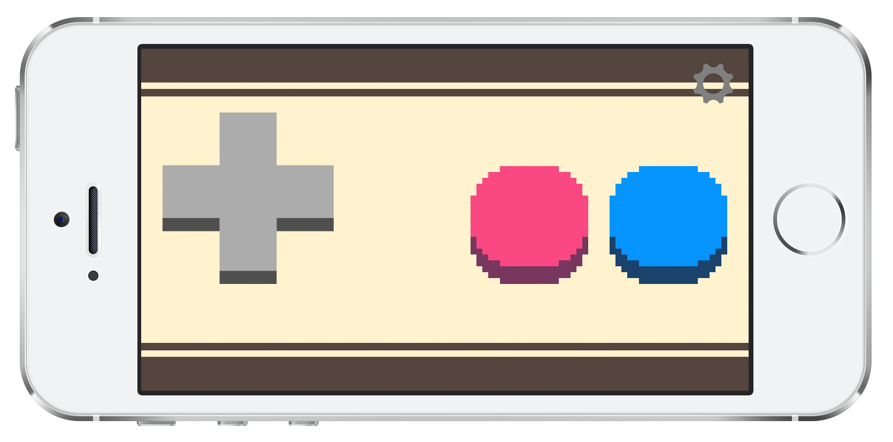
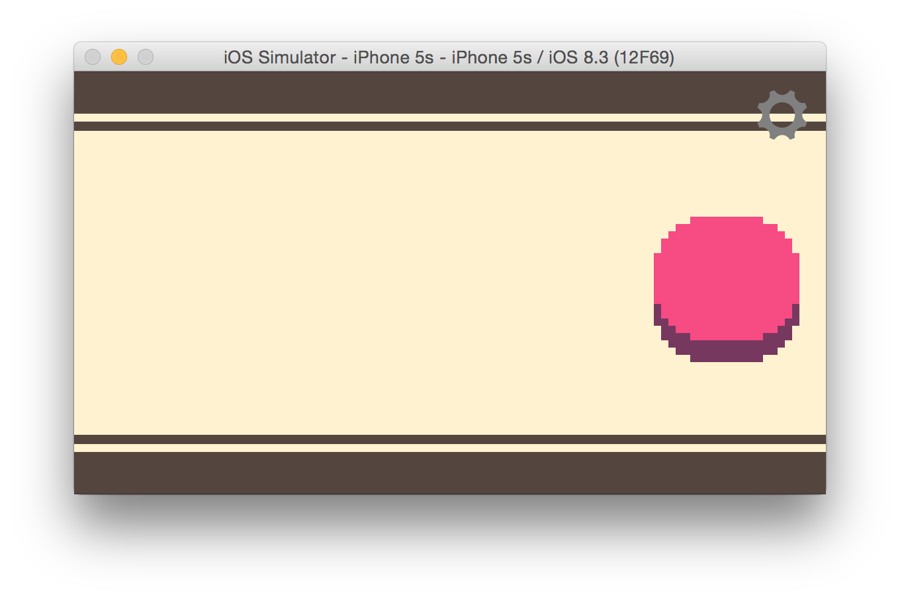
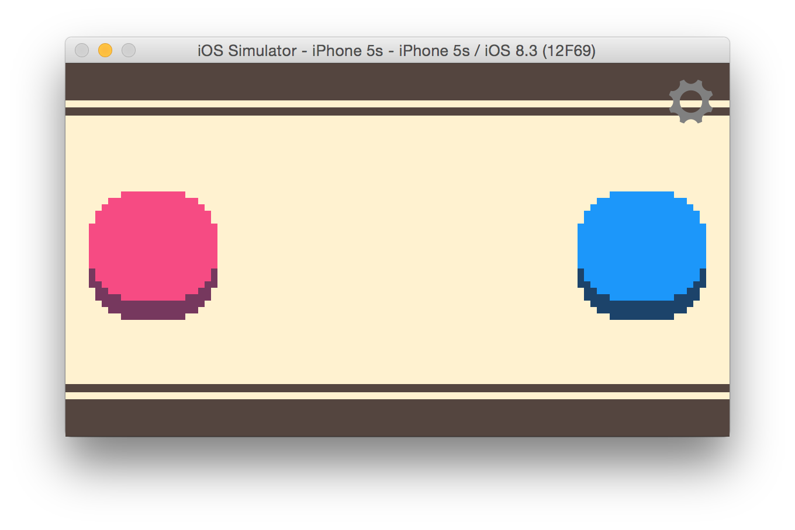
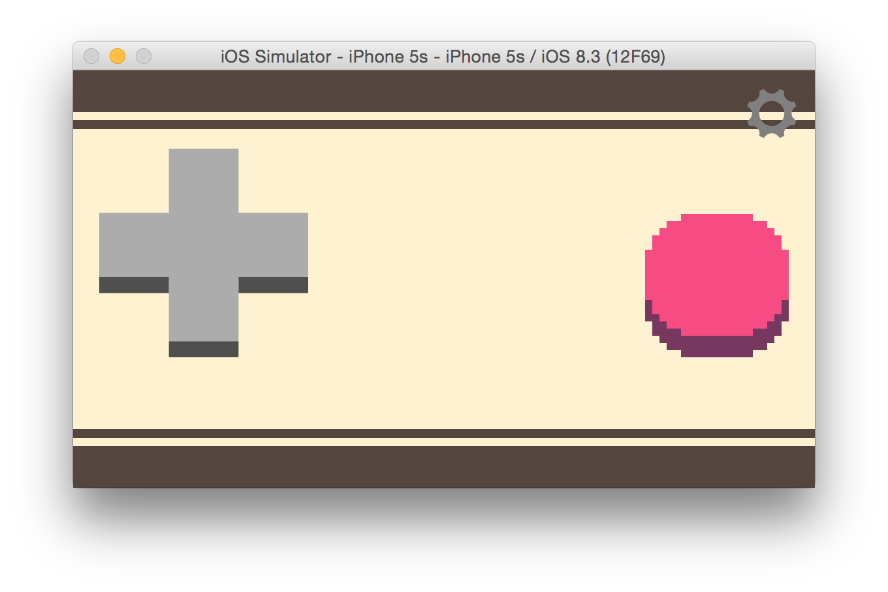
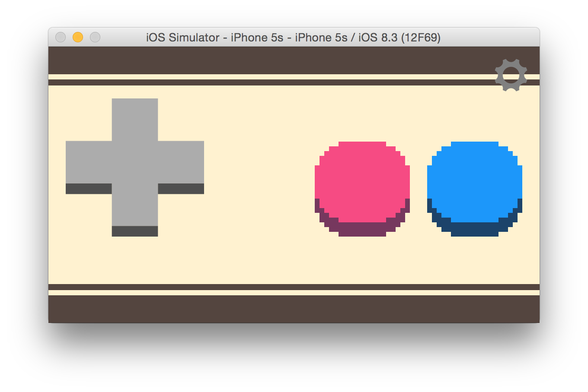
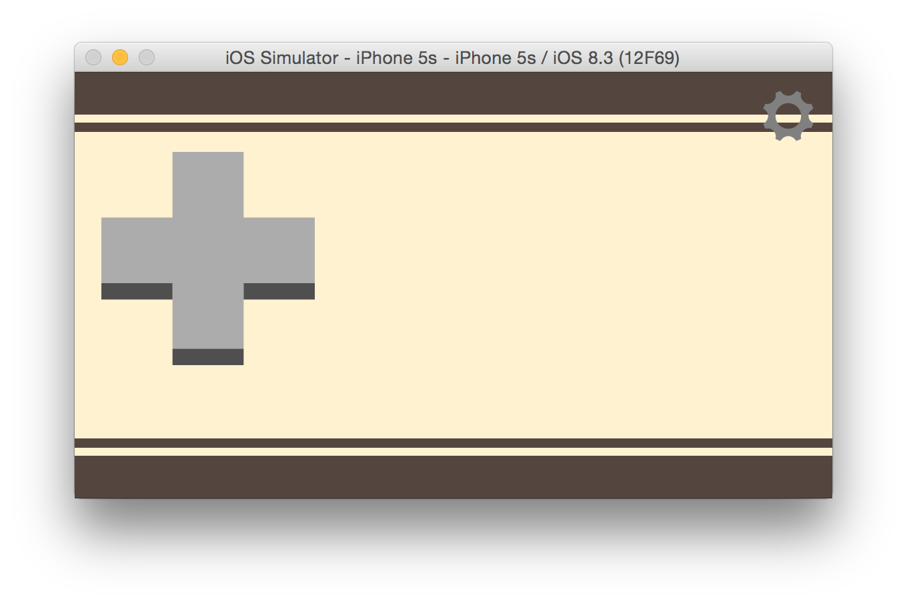
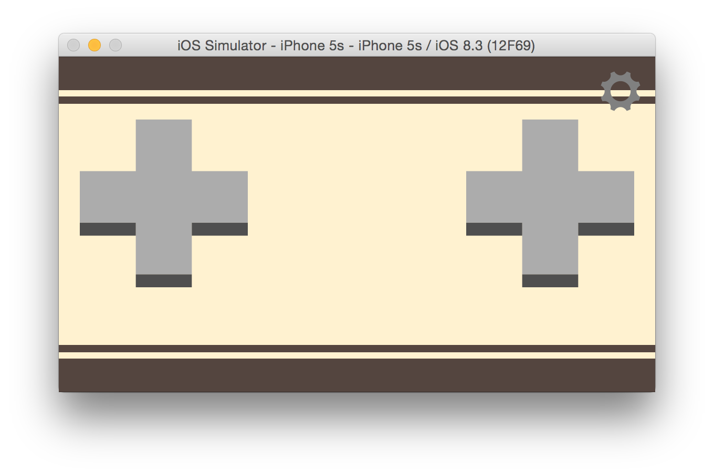
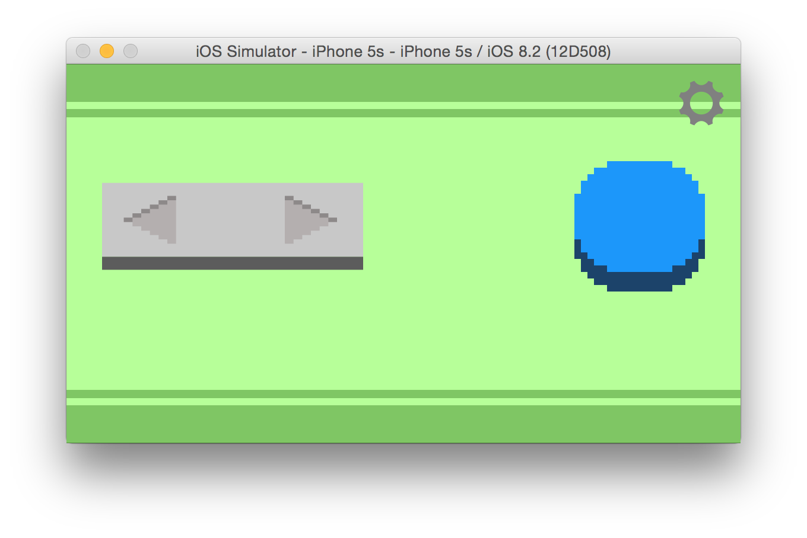
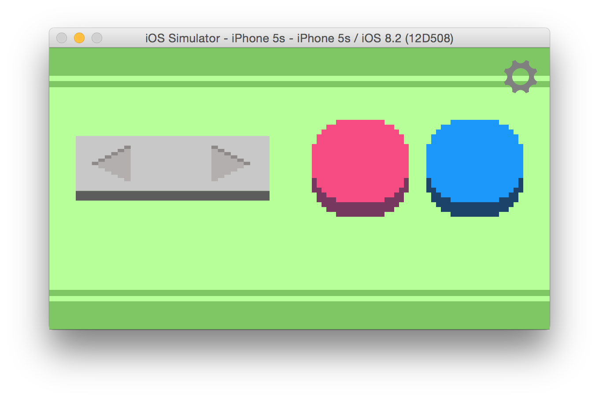
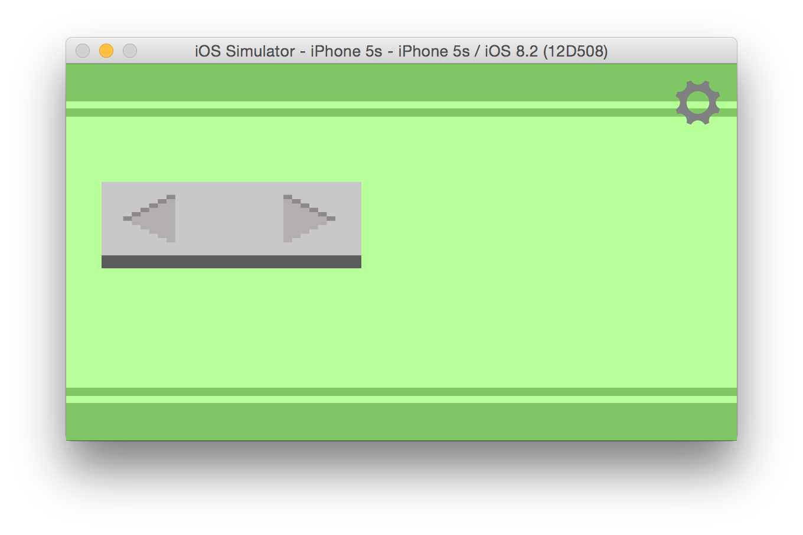

HFT-GAMEPAD-API
===============

This script emualtes the HTML5 Gamepad API using smartphones and [HappyFunTimes](http://superhappyfuntimes.net).
This enables you to easily use HappyFunTimes with any HTML5 game engine.

It's **SUPER EASY TO USE**

Just put the [`happyfuntimes-gamepad-emu.min.js`](https://github.com/greggman/hft-gamepad-api/blob/master/dist/happyfuntimes-gamepad-emu.min.js)
file somewhere and include it at the bottom of your HTML file

    

* Then [run happyfuntimes](http://superhappyfuntimes.net).
* Start your game
* Make sure your smartphone is on the same WiFi as the computer running your game
* On your phone's browser go to `happyfuntimes.net`

In a moment the phone should connect to your game and offer a dpad and 2 buttons. You can connect
any number of phones up to the limit of your WiFi setup.

It's safe to leave the script always on your page. If HappyFunTimes is not running locally
the script as no effect.

## NOTE!!!! NOTE!!!! NOTE!!!! NOTE!!!! NOTE!!!! NOTE!!!!**

While this will work, if your game is not designed for HappyFunTimes you're probably going to be
slightly disappoinetd. By that I mean if your game is expecting an XBox 360 / PS3 controller with
2 analog sticks, a dpad, 13 buttons you're probably not going to be happy with a single DPad
and 2 buttons on a touch screen. Consider designing a game specifically for HappyFunTimes.

## BE CREATIVE

The point of HappyFunTimes is to make **NEW EXPERIENCES**. What can you do with 16 to 30 players?

What this script does do is give you an easy way to get started. You can take any HTML5 engine
that supports the Gamepad API, add this script and get HappyFunTimes support. Of course it's
up to you to design a game that plays well with lots of players.

Once you get started [please consider getting even more creative](http://blog.happyfuntimes.net/blog/thinking-outside-the-box-making-hft-games/).

## Download

* <a href="https://github.com/greggman/hft-gamepad-api/raw/master/dist/happyfuntimes-gamepad-emu.min.js" download>happyfuntimes-gamepad-emu.min.js</a>

* <a href="https://github.com/greggman/hft-gamepad-api/raw/master/dist/happyfuntimes-gamepad-emu.js" download>happyfuntimes-gamepad-emu.js</a>

## Options

There's few options you can specify in your script tag. For example you can set the controller to 1 of 6 types
using a script tag like

    

Controller Types:

*   1button

    

*   2button

    

*   1dpad-1button

    

*   1dpad-2button

    

*   1dpad

    

*   2dpad

    

    Note: 2dpad reports the 2nd dpad on `gamepad.axes[2]` and `gamepad.axes[3]` as well as
    `gamepad.button[16]`, `gamepad.button[17]`, `gamepad.button[18]`, `gamepad.button[19]`

*   1lrpad-1button

    

*   1lrpad-2button

    

*   1lrpad

    

You can also set a few boolean options in the form of

    

Or example setting all options might look like this

    

`dpadToAxis`

normally dpad values show up as both buttons and axes. Settings this to false means
they will only show up as buttons

`axesOnly`

settings this to true means dpad values will only show up as axes.

`reportMapping`

Gamepads have a `mapping` field. The spec only defines 2 values, `"standard"` and `""`.
This script defaults to reporting `standard` even though it can't support all 14 inputs
and 4 axes. Setting `reportMapping` to true will make the script report
`happyfuntimes-<controllerType>-controler` so your game can check for that if you want.

`maxGampads`

Let's you set a maximum number of gamepads. The default is unlimited.
If you set this then when more than that many phones connect those players
over the limit will be put in a waiting list. If other players quit they'll
be added to the game in the order they connected. Also see `queue` in [API](#api)

## API

There's an extra `hft` property on gamepad objects provided by this script. It has
some properties/functions you can use to interact with HappyFunTimes and the controller.

`color`

color is a CSS color. By default the script tries to give each controller a unique
color. You can look at this field in the game if you'd like to match the color
of the player's avatar to the color of the controller. Conversely you can set this
value to a valid CSS color value and the contoller will change color to match.
(eg, "red", or "#37EF4D", or "rgb(25,17,123)", etc.)

`name`

Name is the name the user set on their phone when they started playing. If they
change the name it will be updated

`netPlayer`

This is the [HappyFunTimes NetPlayer object](http://docs.happyfuntimes.net/docs/hft/NetPlayer.html).
You'd probably be better off making
a custom HappyFunTimes controller if you want to do anything um, custom? A few
things you could without a custom contoller are for example register a handler
to be notified if the user changes their name or if they're busy in the system menu.

`queue`

A function you can call to remove this gamepad from the *active* gamepads and put them
in the queue of waiting players. If you set a `maxGamepads` setting then any players
over the limit are in a queue of waiting players. Calling `queue` on a gamepad takes
an active player's gamepad and puts it on the waiting list letting the longest waiting
player into the game. If there no players waiting this is a no-op.

2 use cases come to mind. One, you have a life based game. Each time a player dies you
call `gamepad.hft.queue()` on that player's gamepad letting the next player play. Another is
you have a round based game. At the end of a round you call `gamepad.hft.queue()` on all gamepads
to get a fresh set of players.

## GET INVOLVED!!!

Make some awesome games with HappyFunTimes!! If you have suggestions, ideas feel free to
[add them](https://github.com/greggman/hft-gamepad-api/issues) or
[make a pull request](https://github.com/greggman/hft-gamepad-api/pulls)!

## Building

If you want to change something about this or make a new controller, well first off you can
make controllers for HappyFunTimes games without any of this. See [HappyFunTimes](http://docs.happyfuntimes.net/docs).
But if you want to fix something or make a cool edition a brief explaination.

### Setup

*   [Install node.js](http://nodejs.org/download/).
*   Open a node command prompt and type `npm install -g http-server` (you might need a `sudo` in front)
*   Run these commands

        git clone git://github.com/greggman/hft-gamepad-api.git
        cd hft-gamepad-api
        npm install

### Building

Just type

    grunt

### Running

*   Run [HappyFunTimes](http://superhappyfuntimes.net/install)
*   open a shell/terminal/command prompt with node.js

        cd path/to/repo
        http-server -p 8081

*   Open a browser window to `http://localhost/8081/test/test.html" (This runs a test)
*   Open another browser window to `http://localhost:18679` (this opens a controller on HappyFunTimes)
*   Open an iOS simulator. Start Safari and go to `http://localhost:18679`
*   Pull out your phone, Start Safari or Chrome and go to `http://happyfuntimes.net` (your phone must be on the same router as your computer).

What's happening? HappyFunTimes is a web server. For this particular case it serves web pages to the the phone/simulator/controller windows.
Your game (represented by test.html) runs where ever you're currently hosting it. For this case that's the web server we started with `http-server`.
The script in the game will connect HappyFunTimes running on the same machine. It will give the controller files to HappyFunTimes.
HappyFunTimes will then direct any controller that connects to it to load those files. The game and the controllers pass messages to
each other through HappyFunTimes.

### Code

The script has 3 main parts.

1.  `src/hft-connect.js` is code to try to connect to HappyFunTimes.

2.  `controller` is a set of files that implements a standard HappyFunTimes controller.

3.  `src/controller-support.js` is code that uses a [`GameServer`](http://docs.happyfuntimes.net/docs/hft/GameServer.html)
    to talk to HappyFunTimes to receive messages from phones and to emulate the HTML5 Gamepad API.
    It also sends files the controller files from #2 to HappyFunTimes to serve to the phones. Those files
    bundled into strings as part of the `grunt` build process.

The build pulls all of this into one easy to use script

### Docs

You should probably read the [HappyFunTimes docs](http://docs.happyfuntimes.net/docs/).

### Dev Tips

*   Use the Safari or Chrome remote debugging to see what's happening on the phone. Google it.

*   In `controller/scripts/controller.js` you can use `client.log` and `client.error` to send log messages from the controllers
    to the game. That can be useful for debugging. Just remember to remove them before you ship as they'll
    be eating up your bandwidth.

*   If you use `console.log` or `console.error` anywhere you'll get an error by the eslint when you build.
    add `// eslint-disable-line` to work around that

        console.log("foobar");  // eslint-disable-line

    Yea, a little annoying. Sorry about that.
